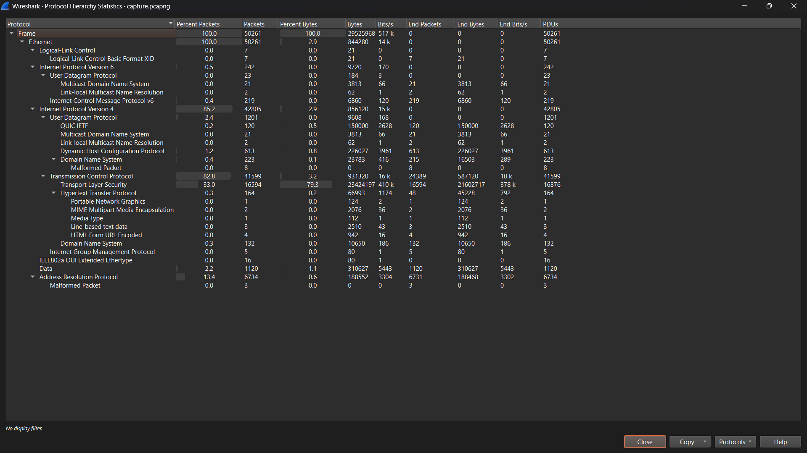

# Wire Shark Packet Analysis

Name: B. Darshan Sai Naath
Roll Number: 241CS114

### 1. Protocol Distribution

Screenshot:

Observations:
The capture shows multiple network-layer and transport-layer protocols in action.

The top five protocols were:

| Protocol | Percentage | Purpose |
|-----------|-------------|----------|
| Ethernet II | ≈ 100 % (Observed: 100 %) | Frames used to carry all packets on the local network. |
| IPv4 | ≈ 90 % (Observed: 85.2%) | Responsible for routing packets between devices over the Internet. |
| TCP | ≈ 70 % (Observed: 82.8%) | Provides reliable, ordered data transfer for web traffic. |
| UDP | ≈ 20 % (Observed: 0.5%) | Used for DNS queries and some streaming traffic like YouTube video packets. |
| TLS v1.3 / HTTP | ≈ 60 % (Observed: 33%) | Application layer protocols for web communication - TLS adds encryption. |

Explanation:
Ethernet II acts as the frame carrier for all packets leaving or entering my network card.
IPv4 handles addressing and routing to ensure packets reach the correct destination.
TCP is dominant because both GitHub and YouTube use HTTPS, which runs over TCP.
UDP appears due to DNS queries and streaming media that don't require perfect delivery.
TLS v1.3 and HTTP appear because HTTPS encrypts ordinary HTTP traffic using TLS.

This analysis shows that most Internet activity relies heavily on TCP/IP and TLS, the same foundation used by decentralized VPNs to secure and route traffic.

---

## 2. DNS Query Analysis

Observations:
I applied the Wireshark filter dns to isolate all DNS traffic. Each domain name I visited (neverssl.com, github.com, youtube.com) generated a query to a DNS server. The responses provided their respective IP addresses.

| Domain | DNS Server IP | Response IP Address | Response Time (ms) | Notes |
|--------|----------------|--------------------|--------------------|-------|
| studio.youtube.com | 10.20.1.22 | youtube-ui.l.google.com (CNAME → HTTPS) | 1.27 ms | Redirects to Google's content infrastructure for video services. |
| github.com | 10.3.0.101 | 20.207.73.82 | 2.05 ms | Resolved directly to GitHub's Azure-hosted IP. |
| neverssl.com | 10.3.0.101 | ns-1716.awsdns-22.co.uk (SOA record) | 1.73 ms | Returned authoritative info; site intentionally runs only on HTTP. |

Explanation:
The queries were initiated from the host 10.50.58.142 (your system) and resolved via internal DNS servers 10.20.1.22 and 10.3.0.101.
Response times indicate near-instant lookups (<3 ms), typical of DNS caching within a LAN or corporate network.
The CNAME record for YouTube shows domain redirection under Google's broader content delivery network.
GitHub's A record maps directly to its public IP, confirming a straightforward lookup.
Neverssl's SOA response shows it's managed through AWS's authoritative DNS servers, consistent with its minimal setup.

These results demonstrate the resolution process and variety of DNS responses that is from aliases to direct mappings to authoritative references, reflecting real-world Internet name resolution.

I learned that DNS resolution is the very first step in loading a website. Without it, a browser cannot start TCP or HTTPS communication.

---

## 3. TCP Three-Way Handshake

Observations:
I used the filter tcp.flags.syn == 1 to locate the beginning of TCP connections. A complete handshake consists of three packets exchanged between client and server.

| Step | Packet | Direction | Description |
|------|---------|------------|-------------|
| 1 | SYN | Client → Server | Browser requests a new TCP session and proposes an initial sequence number. |
| 2 | SYN-ACK | Server → Client | Server acknowledges and replies with its own sequence number. |
| 3 | ACK | Client → Server | Client confirms receipt; connection is now established. |

Explanation:
The three-way handshake ensures both sides are synchronized before any data is transferred.
It establishes reliability, confirming that both devices are ready for communication.
After this handshake, the actual HTTP or TLS data transfer begins.

This process guarantees reliable delivery and connection stability. This is essential for all TCP-based communication such as HTTPS.

---

## 4. HTTP vs HTTPS in Packets

Observations:
I compared packets using the filters http (for plaintext) and tls (for encrypted traffic).

Using the http filter, I could clearly read the HTTP requests and responses for neverssl.com:
The request showed details such as GET /, Host: neverssl.com, and User-Agent.
The response included full HTML content in plain text.

When I switched to the tls filter for github.com and youtube.com, the packets contained:
Client Hello, Server Hello, and Encrypted Application Data messages.
No readable content; everything after the handshake appeared as binary data.

| Feature | HTTP (neverssl.com) | HTTPS (github.com / youtube.com) |
|----------|---------------------|----------------------------------|
| Protocol Port | 80 | 443 |
| Data Visibility | Fully readable (headers, HTML, etc.) | Encrypted binary data |
| Security | No encryption | Protected by TLS |
| Handshake | Not applicable | TLS handshake before data transfer |
| Content in Wireshark | Visible text | Encrypted, unreadable payload |

Explanation:
HTTP traffic from neverssl.com showed clear text data, including headers like GET / and the full HTML page.
HTTPS traffic from GitHub and YouTube appeared as binary data labeled Encrypted Application Data.
TLS encrypts all communication after the handshake, making it unreadable to third parties.

Even though Wireshark can capture HTTPS packets, the content remains hidden due to encryption, demonstrating the importance of TLS for confidentiality and integrity.

---

## What I Learnt from This Task (Wireshark Packet Analysis)

### 1. How Network Layers Work in Real Time
I learnt that every action on the internet that is like opening a webpage involves multiple protocol layers working together:
Ethernet / Wi-Fi handles data transmission within the local network.
IP (Internet Protocol) routes packets between devices globally.
TCP ensures reliable and ordered delivery.
TLS / HTTP operate at the top, handling web data securely.

Wireshark visualized this stack live, helping me connect theory with actual packet flow.

---

### 2. Understanding Protocol Distribution
From the Protocol Hierarchy, I saw how traffic is distributed across protocols like IPv4, TCP, UDP, and TLS.
I realized that:
Most web traffic uses TCP (for reliability).
UDP is lighter and used for DNS or media streaming.
TLS dominates because most modern sites use HTTPS.

This helped me understand why encryption and reliability are balanced differently in different applications (e.g., VPNs vs. video streaming).

---

### 3. How DNS Queries Resolve Domain Names
I discovered that DNS is the first step in communication.
Before a TCP connection starts, the browser sends a DNS query to translate a domain name (like github.com) into an IP address.
The DNS server replies with the IP, allowing the browser to establish a connection.

Without DNS, we'd have to remember numeric IPs or we can say it's basically the phonebook of the Internet.

---

### 4. TCP Three-Way Handshake in Action
The handshake (SYN → SYN-ACK → ACK) was one of the coolest things to observe.
It confirmed that:
The client requests communication (SYN).
The server acknowledges and responds (SYN-ACK).
The client finalizes the connection (ACK).

Explanation:
SYN (Synchronize): Starts a TCP session and sets an initial sequence number.
SYN-ACK: Server confirms it received the client's request and offers its own sequence number.
ACK (Acknowledgment): Final step confirming both sides are ready to communicate.

After the three packets, data transfer begins using this reliable TCP channel.

If any step fails, the connection won't start. This handshake ensures both devices agree on communication parameters and sequence numbers.

This process is critical for web traffic because HTTP and HTTPS run over TCP - it guarantees reliable, ordered data transfer before TLS encryption starts.

I finally saw how TCP ensures both sides are ready before any data is sent and this is exactly where reliability starts FROM OTHER SOURCES. I did get outputs where the final acknowledgement from client to server were not accepted. Most of the stopped at servers' SYN-ACK. I have taken screenshots of such and I've uploaded them. Its half way through yet not fully done.

---

### 5. Encryption and the Difference Between HTTP & HTTPS
By comparing packets:
HTTP traffic from neverssl.com was fully visible that is the headers, the methods, even the HTML text.
HTTPS traffic from GitHub and YouTube was unreadable and all data was encrypted.

The TLS handshake and encryption layers hide sensitive information like passwords or messages.

This visual proof made me appreciate how crucial encryption is and even if someone captures packets, they can't decode HTTPS data.

---

### 6. Real-World Insight for the Project
Analyzing raw packets showed me what a VPN or decentralized VPN (dVPN) actually protects:
I understood that it encrypts traffic at a lower layer (below TLS), so even your DNS queries and IP metadata stay private.
The same TCP/TLS principles appear inside a VPN tunnel but actually wrapped with an extra layer of encryption and routing.

This connection between Wireshark observations and VPN architecture made me understand how security, privacy, and performance tie together.

---

### Just an overall summary
Through this Wireshark Packet analysis, I've learnt how the internet communicates at the packet level. That is from the DNS lookups to TCP handshakes and TLS encryption.

Every single request travels through multiple layers, each having its own purpose.

Now I not only know what HTTP and HTTPS are but how they actually move across the network, and why securing them is so essential and especially in the context of a Blockchain-based Decentralized VPN.
